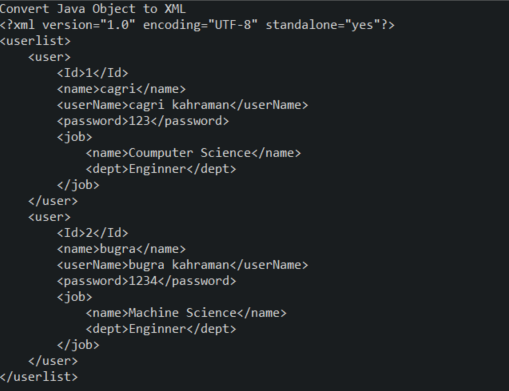
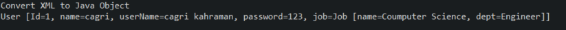

# Jaxb-Project 
# XML used to in project

```xml
<?xml version="1.0" encoding="UTF-8" standalone="yes"?>
<userlist>
    <user>
        <Id>1</Id>
        <name>Çağrı</name>
        <userName>Çağrı Kahraman</userName>
        <password>123</password>
        <job>
            <name>Coumputer Science</name>
            <dept>Engineer</dept>
        </job>
    </user>
    <user>
        <Id>2</Id>
        <name>Buğra</name>
        <userName>Muhammed Buğra Kahraman</userName>
        <password>1234</password>
        <job>
            <name>Machine Science</name>
            <dept>Engineer</dept>
        </job>
    </user>
</userlist>
```

# Convert Java Object -> XML Data



# Convert XML Data -> Java Object 


